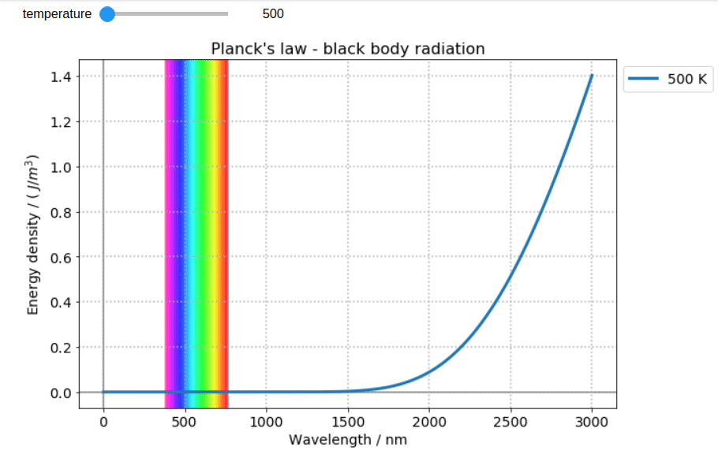
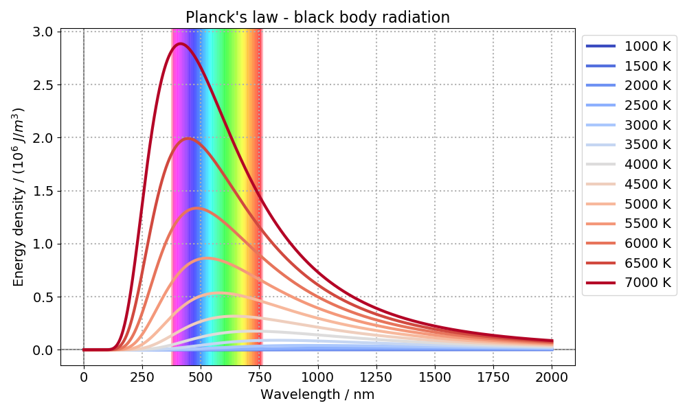

# Planck's law

A simple script to plot the Planck's law. Planck's law describes the spectral
density of electromagnetic radiation emitted by a black body in thermal
equilibrium at a given temperature, when there is no net flow of matter or
energy between the body and its environment.



## Installation

Just clone or download this repo. This is not a package (yet, maybe someday :-))

## Usage

You can run a sample via command line from the project folder after cloning this repo:

```bash
python planck.py
```

A figure like the one below will be generated.



To see how to customize the plot and how to animate it like the gif at the top
of this readme, see the [tutorial file](tutorial.ipynb).

## Under the hood - requirements

This project relies mainly on SciPy, Matplotlib and numpy.

## Contributing

All contributions are welcome.

**Issues**

Feel free to submit issues regarding:

- recommendations
- more examples for the tutorial
- enhancement requests and new useful features
- code bugs

**Pull requests**

- before starting to work on your pull request, please submit an issue first
- fork the repo
- clone the project to your own machine
- commit changes to your own branch
- push your work back up to your fork
- submit a pull request so that your changes can be reviewed


## License

MIT, see [LICENSE](LICENSE)

## Citing

If you use this project in a scientific publication or in classes, please consider citing as

F. L. S. Bustamante, *Planck's law* - Plotting the black body radiation, 2020 -
Available at: https://github.com/chicolucio/planck
