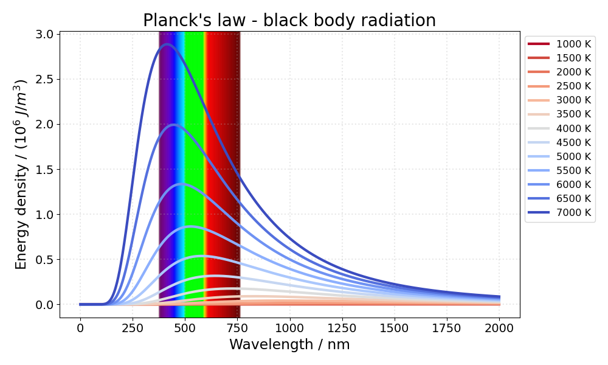

# Planck's law

A project to study the Planck's law. Planck's law describes the spectral
density of electromagnetic radiation emitted by a black body in thermal
equilibrium at a given temperature, when there is no net flow of matter or
energy between the body and its environment.


Interactive web app:

<p align="center">
<a href="https://planck.streamlitapp.com/" target="_blank">
</a>
</p>

## Installation and usage

1. clone the repo
2. create a virtual environment
3. activate the virtual environment
4. install dependencies with [`requirements.txt`](requirements.txt)
5. use the code and/or run a local Streamlit app

```bash
git clone git@github.com:chicolucio/planck.git
cd planck
python -m venv .venv
source .venv/bin/activate
pip install -r requirements.txt
streamlit run Home.py
```

These are the Python packages under the hood:


You can run a sample via command line from the project folder after cloning this repo:

```bash
python planck.py
```

A figure like the one below will be generated.



To see how to customize the plot and how to animate it like the gif at the top
of this readme, see the [tutorial file](tutorial.ipynb).

Interactive web app hosted on Streamlit Cloud:

<p align="center">
<a href="https://planck.streamlitapp.com/" target="_blank">
</a>
</p>

## Contributing

All contributions are welcome.

**Issues**

Feel free to submit issues regarding:

- recommendations
- more examples for the tutorial
- enhancement requests and new useful features
- code bugs

**Pull requests**

- before starting to work on your pull request, please submit an issue first
- fork the repo
- clone the project to your own machine
- commit changes to your own branch
- push your work back up to your fork
- submit a pull request so that your changes can be reviewed


## License

MIT, see [LICENSE](LICENSE)

## Citing

If you use this project in a scientific publication or in classes, please consider citing as

F. L. S. Bustamante, *Planck's law* - Plotting the black body radiation, 2020 -
Available at: https://github.com/chicolucio/planck

## More

- [LinkedIn](https://www.linkedin.com/in/flsbustamante/)
- [Portfolio](https://franciscobustamante.com.br/portfolio)
- [Curriculum Vitae](https://franciscobustamante.com.br/about/)